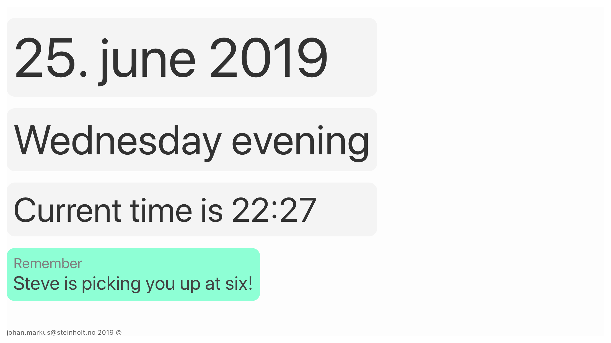

# Elsa

Elsa is an app that turns an iOS device into a clear an easily readable clock + calendar for the elderly!

It also features the ability to show currently ongoing calendar events as messages to enable sending messages to the screen via a shared calendar.

## Installation

The app was previously featured on the app store, but is now open sources here. Build and install using Xcode.
